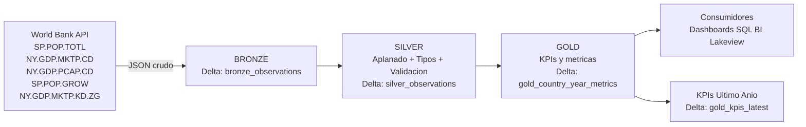

# databricks-wroldbank-project

Lakehouse Medallion **serverless** en Databricks con datos en vivo del **Banco Mundial**. Incluye:
- Ingesta desde API pública (sin archivos locales).
- Arquitectura **Medallion** (Bronze/Silver/Gold).
- **Terraform** (Jobs + Dashboard) y **GitHub Actions**.
- **Schedule diario** a las 02:00 (America/Bogota).
- Indicadores: 
  - `SP.POP.TOTL` (Población total)
  - `NY.GDP.MKTP.CD` (PIB USD actuales)
  - `NY.GDP.PCAP.CD` (PIB per cápita USD actuales)
  - `SP.POP.GROW` (Crecimiento poblacional anual, %)
  - `NY.GDP.MKTP.KD.ZG` (Crecimiento PIB anual, %)

## Arquitectura (Medallion)

## Tablas publicadas
- `hive_metastore.worldbank_demo.bronze_observations`
- `hive_metastore.worldbank_demo.silver_observations`
- `hive_metastore.worldbank_demo.gold_country_year_metrics`
- `hive_metastore.worldbank_demo.gold_kpis_latest`

## Despliegue rápido
1) En tu repo GitHub, define secretos: `DATABRICKS_HOST`, `DATABRICKS_TOKEN`  
2) Variables (opcional): `TF_VAR_repo_url`, `TF_VAR_repo_branch`.
3) Ejecuta el workflow **databricks-pipeline** (Terraform + Run Now).
4) Terraform crea el **Job** (schedule diario 02:00 America/Bogota) y un **Databricks SQL Dashboard** básico.

## KPIs y métricas
- `population_yoy_growth` (preferente desde `SP.POP.GROW`/100; fallback YoY calculado)
- `gdp_yoy_growth` (preferente desde `NY.GDP.MKTP.KD.ZG`/100; fallback YoY calculado)
- `gdp_per_capita` (preferente `NY.GDP.PCAP.CD`; fallback `gdp_current_usd / population_total`)

## Licencias de datos
- Banco Mundial, **CC BY-4.0**.
